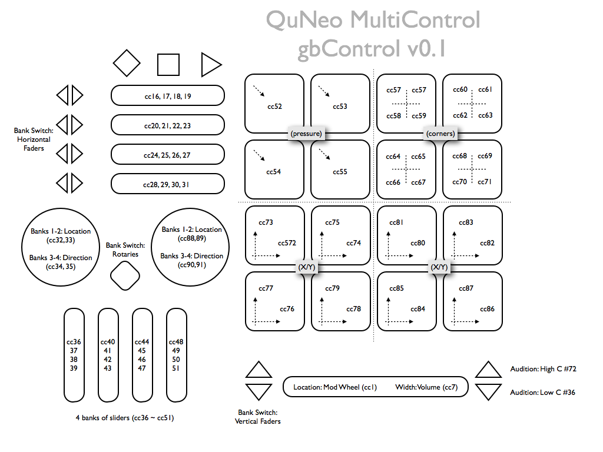

# README

[QuNeo](http://www.keithmcmillen.com/QuNeo/overview) gbControl layout. This uses and abuses QuNeo's v1.2 software/firmware to show off multiple banks, x/y controllers, mixed grids and drum pads, pressure control, and so on.

If you can use MIDI Learn, there's fun to be had in any number of interesting combined controls here.

**License:** Please distribute. Please improve. Credit me if you fork and/or distribute. Above all, distribute and improve on this template ([CC-BY](http://creativecommons.org/licenses/by/3.0/)).

Thanks, – gb

---

